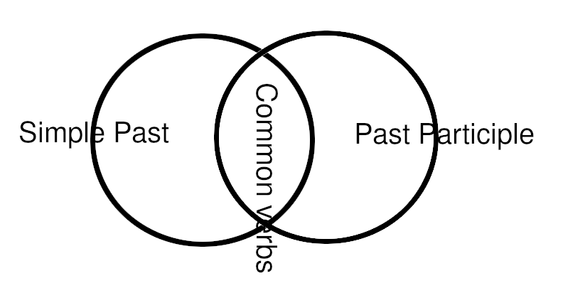

# Description
Print list of verbs not common between Simples and Participle.
If the verb on Past participle is equal to simple past, do not print on output

* simple_past.csv: list of irregular verbs the [simple past](https://en.wiktionary.org/wiki/simple_past)
* past_participle.csv: list of irregular verbs the [past participle](https://en.wiktionary.org/wiki/past_participle)

# File structure
* simple_past.csv\
    [verb present/future];[verb simple past]
* past_participle.csv\
    [verb present/future];[verb past participle]

# Examples
| Verb  | Simples past | Past participle | OUTOUT |
|-------|--------------|-----------------|--------|
| drink | drank        | drunk           |  Yes   |
| buy   | bought       | bought          |  No    |
| put   | put          | put             |  ---   | 

**Verbs that do not change (e.g put) are not present in the files**

